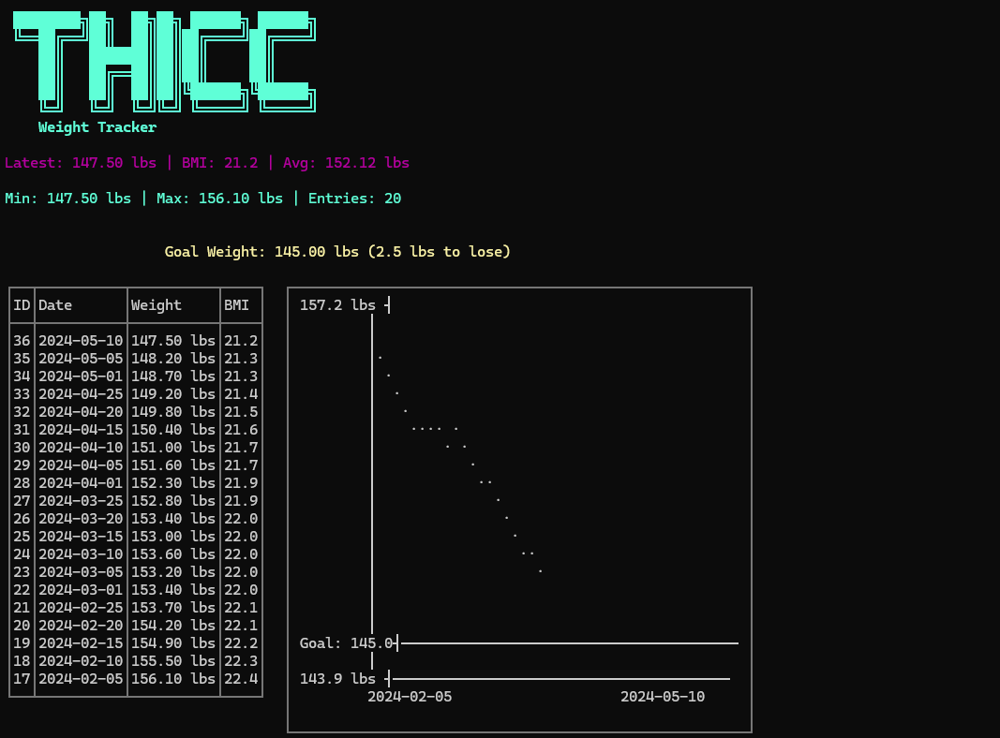

# THICC - Weight Tracking CLI

A simple command-line tool for tracking your weight over time with visualization.

<div align="center">
  
  <p><em>Track your weight, visualize your progress, and reach your goals</em></p>
</div>

## Features

- Track weight entries with automatic BMI calculation
- Visual table display with ASCII line graph
- Support for both metric (kg/cm) and imperial (lbs/in) units
- Date-based filtering and historical views
- SQLite database storage in `~/.thicc/weights.db`

## Installation

Build from source:

```bash
go build -o thicc.exe
```

## First Launch

On first launch, you'll be prompted to configure:
- Weight unit (lbs or kg)
- Height unit (in or cm)
- Your height
- Your goal weight

These settings are stored and used for BMI calculations and goal tracking.

## Commands

### Add a weight entry

```bash
# Add weight for today
thicc add 70.5

# Add weight for a specific date (YYYY-MM-DD)
thicc add 68.2 2024-12-15
```

### Show weight history

```bash
# Show last 20 entries (default)
thicc show

# Show last 50 entries
thicc show 50

# Show entries from a specific date to today
thicc show 2024-01-01
```

### Modify a weight entry

```bash
# Update weight for entry ID 5
thicc modify 5 69.8
```

### Delete a weight entry

```bash
# Delete entry ID 3
thicc delete 3
```

### Set goal weight

```bash
# Set goal weight to 150 lbs
thicc goal 150
```

### Reset everything

```bash
# Wipe all data and settings (requires confirmation)
thicc reset
```

## Display

The `show` command displays:
- **Top**: Goal weight with difference (to lose/to gain)
- **Left side**: Table with Weight ID, Date, Weight, and BMI
- **Right side**: Line graph showing weight trend over time with goal weight line
- **Header**: Latest weight, BMI, average, min/max statistics

## BMI Categories

- Underweight: < 18.5
- Normal: 18.5 - 24.9
- Overweight: 25 - 29.9
- Obese: ≥ 30

## Database

Data is stored in `~/.thicc/weights.db` using SQLite.

## Testing

Run unit tests:

```bash
go test ./tests/... -v
```

## License

MIT License
